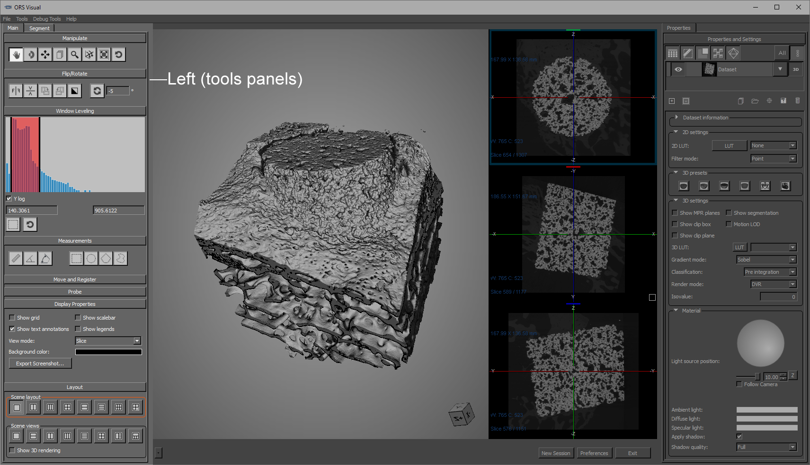
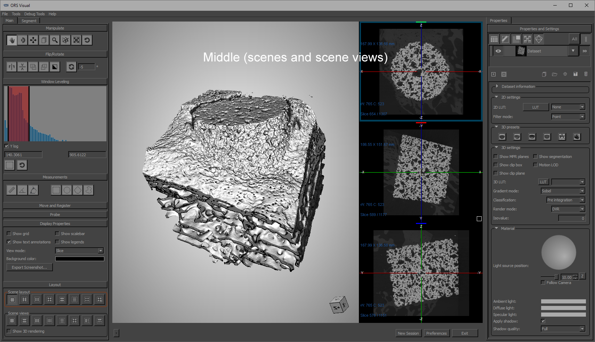
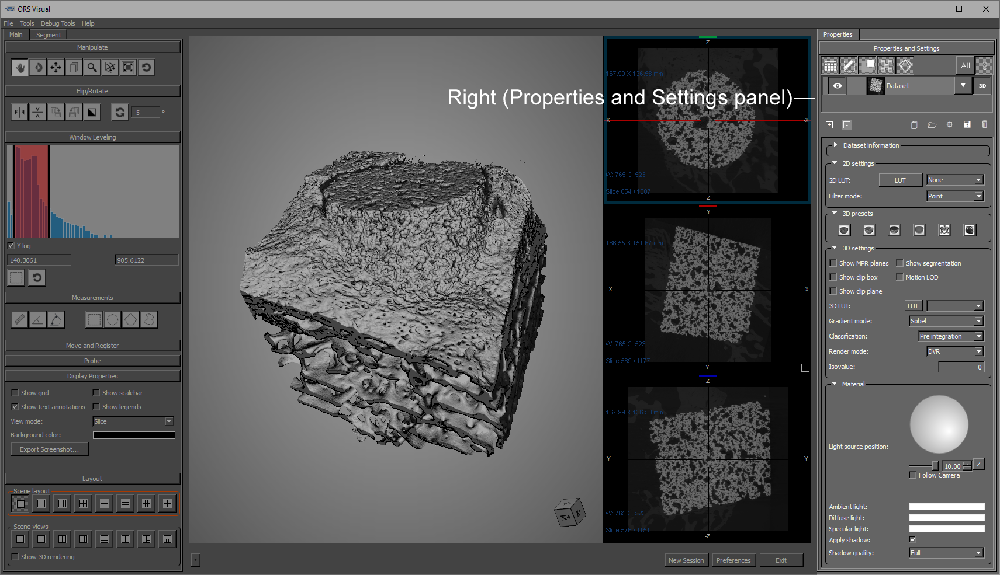
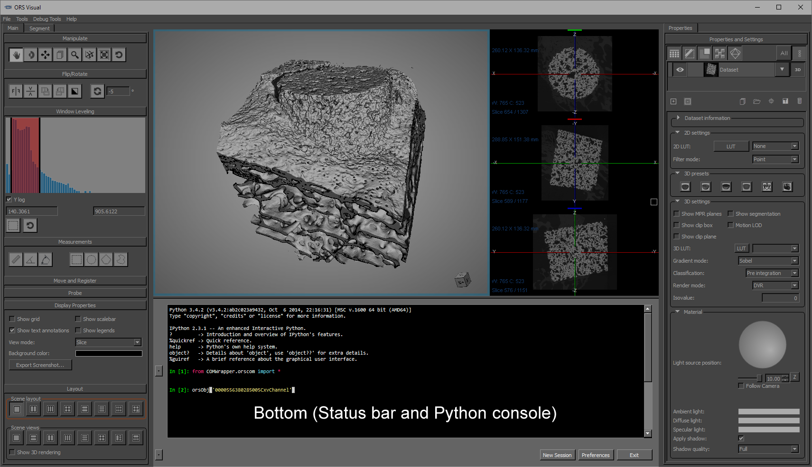
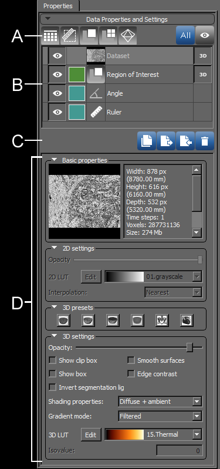
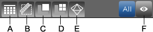

用户界面
-----------------------

Dragonfly支持两类基本操作：对视景的显示与对目标的处理。 软件设计的风格是让所有的操作都可以从主界面中实现。 左侧栏有两个标签页，一个是基本的图像操控和测量工具，一个是高级功能（譬如分割）。工作区中间的视景区域用来显示数据导入后得到的视图，以及处理过后的目标对象。右侧栏主要是数据的属性与设置，以及相关流程的控制。

工作区
~~~~~~~~~~~~~~~~
Dragonfly的工作区配置非常灵活，可以让你定制成最喜欢的样式。工作区主要包含以下几个部分：

左侧：Dragonfly的左侧栏是各种工具面板的默认位置，例如图像操控、窗宽窗位、探针、场景视图属性等。默认设置的左侧栏布局如下图所示：

中间：Dragonfly工作区的中间部分包含了场景（用以显示图像文件、表面模型文件、感兴趣区、及其他目标对象），如下图所示：

右侧：Dragonfly工作区的右侧是数据属性与设置面板，让用户选择目标对象并查看其相关的信息与设置，如下图所示：

底部：Dragonfly工作区的底部是状态栏和其他一些面板，例如动画制作和Python控制台，如下图所示：

数据属性与设置面板
~~~~~~~~~~~~~~~~~~~~~~~

数据属性与设置面板（Data Properties and Settings panel）的默认位置在工作区的右侧栏，它列出了可以在场景视图中显示的数据集和目标对象。当在数据属性与设置面板的顶部选择一个目标对象之后，面板的底部就相应地显示了该目标对象相关的信息、设置、与工具。右键弹出菜单也提供了常用的操作以及高级功能与工具。

*A. 对象选择 B. 对象列表 C. 操作选项 D. 信息与设置*

**对象选择**

数据属性与设置面板最顶部的按钮可以决定哪些对象显示在下方的列表中。

*A. 数据集 B. 标注 C. 感兴趣区 D. 复合感兴趣区 E. 表面模型 F. 可见对象*

点击“数据集”按钮则只显示数据集，点击“感兴趣区”按钮则只显示感兴趣区，点击“表面模型”按钮则只显示表面模型，以此类推。

点击“全部”按钮则显示所有对象。

点击“可见对象”则只显示当年场景中设置为可见的对象。

按住Ctrl键再选择按钮可以把组合对象。
